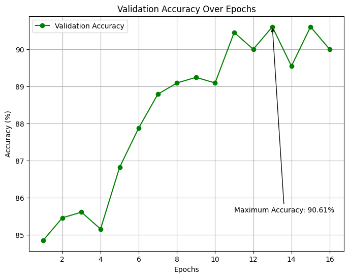
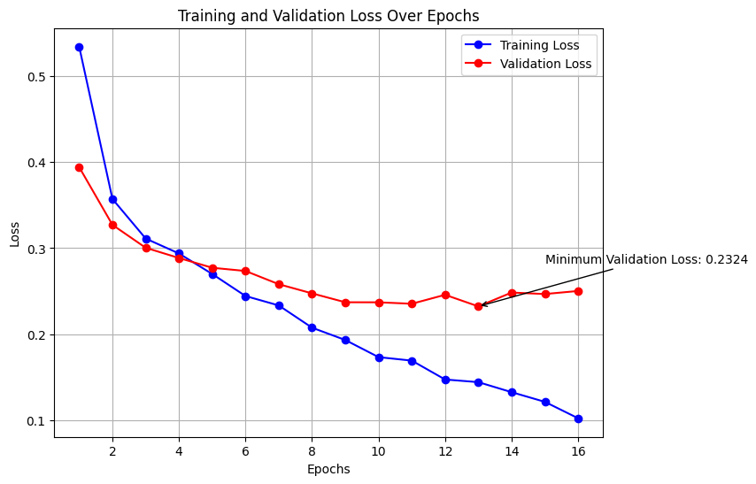

# Skin Cancer Classification using ResNet18

## Introduction
This project aims to classify skin lesions as benign or malignant using a modified ResNet18 model.



## Features
- Utilizes a modified ResNet18 architecture for high accuracy.
- Trained on a comprehensive dataset of skin lesion images.
- Easy-to-use interface for making predictions on new images.

## Requirements
I tested in only on my environment, so I can't guarantee that it will work on yours. My environment is as follows:
- Windows 11
- Python 3.11.4
- RTX 4070 GPU
- CUDA 12.3
- Driver Version: 546.17

## Installation

To set up the project, follow these steps:

1. Clone the repository:
   ```bash
   git clone https://github.com/pietrykovsky/lesion-classifier.git
   cd lesion-classifier

2. Install the required packages:
   ```bash
   pip install -r requirements.txt
   ```

3. Download the dataset from [here](https://www.kaggle.com/fanconic/skin-cancer-malignant-vs-benign) and extract it to the project root folder.
